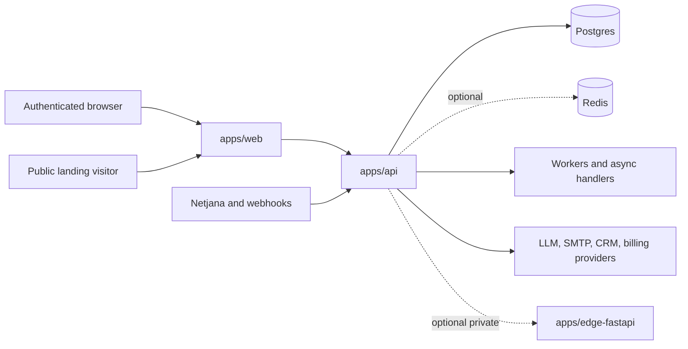

# CraftMyFunnel Master System Architecture

## Purpose

This is the repo-level source of truth for the system that actually exists today. It replaces older descriptions that referred to a separate "managed runtime" control-plane topology that is no longer the primary shape of this repository.

## Deployable Services

CraftMyFunnel is a monorepo with **three deployable apps**:

1. `apps/web` - public Next.js application
2. `apps/api` - public Fastify API and worker runtime
3. `apps/edge-fastapi` - optional private FastAPI edge runtime

Shared code lives in `packages/*`, currently including `packages/toon-core`.

## Production Topology

### Public surfaces

- `apps/web`
- `apps/api`

### Private or internal surfaces

- Postgres
- Redis
- `apps/edge-fastapi`
- provider secrets and signing keys

## Architectural Boundaries

### `apps/web`

Owns:

- marketing pages
- authenticated dashboard and setup flows
- public landing-page render path
- lightweight route handlers that are appropriate to run in the web app
- API proxy and browser-facing auth/session behavior

Should not become the home of core business mutations that belong in the API service.

### `apps/api`

Owns:

- core business APIs
- Prisma/database access
- workers and background job dispatch
- buyer-signal intake and normalization
- AI generation path, guardrails, usage logging, and credit enforcement
- governance, audit, feature flags, and operational readiness checks

This is the system-of-record backend.

### `apps/edge-fastapi`

Owns only optional edge concerns:

- private edge execution
- hardware-adjacent or browser-adjacent workloads
- local or isolated runtime behavior when explicitly enabled

It should remain optional for the main web/API launch path.

## Core Request Flows

### 1. Authenticated product flow

1. User enters through `apps/web`
2. Web middleware/session checks run
3. Business operations go to `apps/api`
4. API validates team context, roles, flags, and payloads
5. API reads/writes Postgres and may queue work

### 2. Public landing flow

1. Visitor requests `/p/[slug]` from `apps/web`
2. Published landing content is rendered from stored state
3. Lead capture and event tracking flow into `apps/api`
4. Landing HTML is sanitized before public render

### 3. Buyer-signal flow

1. External signal source posts to API webhook endpoints
2. API validates source and payload
3. Signal is normalized and written to team/campaign/lead context
4. Hot signals can enqueue review-first follow-up refresh work
5. Human review remains the safe default for outbound actions

### 4. AI generation flow

1. Route validates auth, team scope, and input size
2. `aiInputGuardrails` evaluates the request
3. `aiService` reserves estimated credits
4. Model provider call executes
5. usage, cost, and settlement are persisted
6. bounded output returns to the caller

## Data Ownership

### Required

- **Postgres**: required for auth, data, workflow state, governance, and readiness checks

### Optional

- **Redis**: optional for cache/queue acceleration; runtime should degrade gracefully when absent unless a workflow explicitly depends on it

### Persistence rules

- API is the primary owner of business-state writes
- web should treat the API as the boundary for most product mutations
- edge should not introduce an alternate source of truth

## Cross-Cutting Controls

- role-aware access control
- feature-flag gating
- audit logging
- prompt guardrails
- credit reservation and settlement
- HTML sanitization on public landing render
- readiness, health, and metrics endpoints
- optional infra degradation for Redis

## Current Readiness View

### Strong

- API readiness audit is currently `100/100`
- web/API/edge service boundaries are understandable and documentable
- local Docker-backed Postgres and Redis support realistic beta flows
- launch-path docs now reflect the current monorepo topology

### Not Yet Broad-Launch Ready

- web unit coverage is currently non-deterministic in this tree, with timeouts observed in health, metrics, and worker-dispatch tests
- latest local fixes still need a confirmed green GitHub Actions run
- dependency security debt remains in the npm dependency graph
- edge runtime remains optional and should not be considered part of the required launch path

## Documentation Contract

When the runtime shape changes, update these files together:

1. `README.md`
2. `MASTER_SYSTEM_ARCHITECTURE.md`
3. `docs/ARCHITECTURE.md`
4. `docs/context/ARCHITECTURE.md`
5. `docs/context/LAUNCH_READINESS.md`
6. the current readiness assessment in `docs/`
