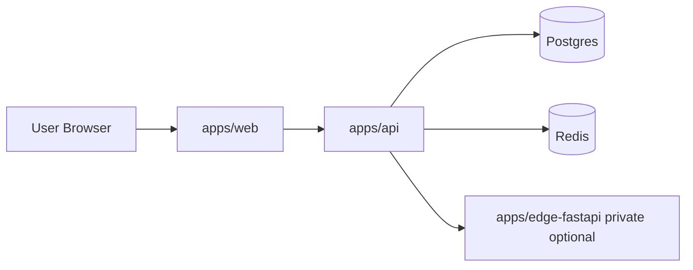

# ConvoSpan Master System Architecture (Current)

## Scope

This document describes the current architecture used for the startup launch path:

- email-first private beta
- monorepo with independently deployable apps
- edge runtime optional and private

---

## Deployable Apps

ConvoSpan has 3 deployable apps under `apps/`:

1. `apps/web` (Next.js): public web app
2. `apps/api` (Fastify): public backend API
3. `apps/edge-fastapi` (FastAPI): optional private edge execution service

Single git repo does not mean single deployment unit. It means shared code ownership with split deployment pipelines.

---

## Runtime Topology

Full GitHub-renderable Mermaid diagrams are maintained in [`docs/architecture-diagram.md`](docs/architecture-diagram.md).



### Public services

- `web`
- `api`

### Private/internal services

- `postgres`
- `redis`
- `edge-fastapi` (recommended private by default)

---

## Responsibilities By App

### `apps/web`

- onboarding, dashboard, marketing, pricing, setup UI
- authenticated user flows
- calls API for business operations
- beta feature gating at route/UI level

### `apps/api`

- campaign, lead, approval, billing, analytics APIs
- database access via Prisma
- queue/task handling
- system health and operational endpoints

### `apps/edge-fastapi` (optional)

- edge execution endpoints
- hardware/edge-specific operations when enabled
- kept private for beta unless explicitly required

---

## Data Boundaries

- primary system state: Postgres
- transient queue/cache: Redis
- API owns database writes for core workflows
- web should treat API as system boundary for business operations

---

## Monorepo And Separate Hosting

### Why One Repo

- atomic cross-app changes (UI + API + schema in one PR)
- single CI policy surface (quality/security checks)
- shared scripts and dependency management
- lower coordination overhead for early-stage team

### How To Host Separately From One Repo

Define one service per app with independent root paths:

- web service root: `apps/web`
- api service root: `apps/api`
- edge service root: `apps/edge-fastapi`

Use path-based deploy triggers:

- `apps/web/**` -> deploy web
- `apps/api/**` -> deploy api
- `apps/edge-fastapi/**` -> deploy edge

For shared files (`package-lock.json`, root scripts, shared schema/config), trigger deploys for impacted services.

---

## Environments

Use at least:

- `staging`
- `production`

Recommended environment variables by service:

- web: `NEXT_PUBLIC_API_URL`, auth/public keys
- api: `DATABASE_URL`, `REDIS_URL`, provider secrets, edge URI (if used)
- edge: runtime/hardware variables only when edge is enabled

---

## Startup Beta Mode

Current launch mode prioritizes reliability:

- web + api + postgres required
- redis recommended (cache/queue), but the system should boot without it
- edge optional
- linked automation surfaces gated for beta where required

Local fast path:

```bash
npm run beta:start
```

This command starts infra, syncs schema, and starts/reuses web and API services.

All three apps locally:

```bash
npm run beta:start:all
```

This also ensures `edge-fastapi` is up on port `8000`.

---

## CI And Build Environments

Build/test runners (GitHub Actions, preview deploys) should not assume Postgres/Redis exist unless the pipeline provisions them.

- Workflows that need Postgres/Redis should use service containers and run `prisma db push` before executing integration steps.
- Redis-backed features should degrade gracefully when `REDIS_URL` is not set.

---

## Decision Summary

There are 3 apps because responsibilities are different and deploy cadence is different.
There is 1 repo because coordination speed and consistency matter more than repo count at startup stage.
They are hosted separately by using app-level service roots and path-filtered deploy pipelines.
