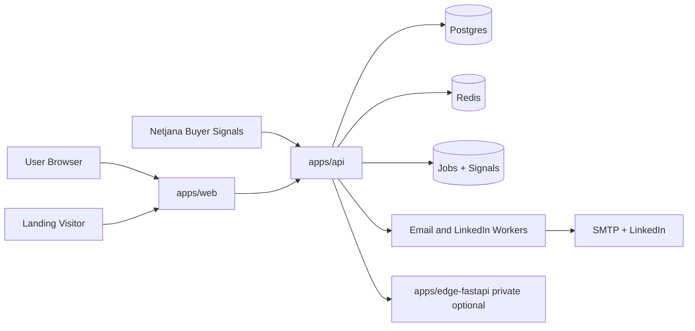

# ConvoSpan Master System Architecture (Current)

## Scope

This document describes the current architecture used for the startup launch path:

- email-first private beta
- Netjana buyer-signal ingest and signal-aware outreach
- monorepo with independently deployable apps
- edge runtime optional and private

---

## Deployable Apps

ConvoSpan has 3 deployable apps under `apps/`:

1. `apps/web` (Next.js): public web app
2. `apps/api` (Fastify): public backend API
3. `apps/edge-fastapi` (FastAPI): optional private edge execution service

Single git repo does not mean single deployment unit. It means shared code ownership with split deployment pipelines.

---

## Runtime Topology

Full GitHub-renderable Mermaid diagrams are maintained in [`docs/architecture-diagram.md`](docs/architecture-diagram.md), including layered, request-lifecycle, control-plane, data-plane, Netjana buyer-signal, email/LinkedIn channel, and Landing Agent funnel diagrams.



### Public services

- `web`
- `api`

### Private/internal services

- `postgres`
- `redis`
- `edge-fastapi` (recommended private by default)

---

## Layered Architecture

ConvoSpan is organized around explicit runtime, domain, data, and control boundaries. The goal is to keep public web delivery, API ownership, persistence, and optional edge execution separate while preserving fast cross-app development in one repo.

| Layer | Name | Primary owner | Notes |
| --- | --- | --- | --- |
| 0 | Actors and Channels | Product surfaces | Browser users, anonymous landing visitors, email/LinkedIn prospects, operators, extension users, webhook senders |
| 1 | Delivery and Routing | `apps/web` + `apps/api` | Next middleware, public allowlist, feature gates, API proxy, direct API ingress, CORS, rate limits |
| 2 | Web Experience | `apps/web` | Marketing pages, dashboard, setup wizard, campaign UI, Intel dashboard, Landing Agent UI, public pages |
| 3 | API Runtime Boundary | `apps/api` | Fastify server, route loader, Next-style route adapter, request/response bridge |
| 4 | Application Services | `apps/api/routes` | Route handlers grouped by campaign, setup, billing, analytics, landing-agent, intel/webhooks, extension, admin |
| 5 | Domain Modules | `apps/api/src/modules` | Campaigns, leads, landing-agent, intel/signals, knowledge, workflows, inbox, governance, settings |
| 6 | AI and Automation | `apps/api/src/modules`, workers | Prompt builders, Netjana normalize/score/match, signal-aware email composer, model gateway, guardrails, channel workers, event store |
| 7 | Data Access and Persistence | Prisma + infra | Postgres primary state, ShadowSignal/ScrapingJob/Job rows, Redis optional cache/queue, knowledge assets, audit/system events |
| 8 | External Integrations | Provider adapters | Netjana/ConvoSpan Intel, LLMs, SMTP, LinkedIn/browser actions, payments, CRM/enrichment |
| 9 | Optional Private Edge | `apps/edge-fastapi` | Private edge execution, browser or hardware-backed tasks |

### Cross-Cutting Controls

- Auth/session context flows through web middleware and API request-aware auth helpers.
- Team RBAC and workspace selection are enforced before domain-service mutation.
- Public landing endpoints are allowlisted but still rate limited and input validated.
- Netjana webhook ingest validates `x-source`, API key scope, payload shape, and optional HMAC before any signal becomes trusted context.
- Governance approval, audit logging, and guardrails sit across publish/send/automation workflows.
- Redis-backed behavior must degrade gracefully unless a workflow explicitly provisions Redis.

---

## Buyer Signal And Channel Flow

Netjana is connected through the Intel service path:

1. Netjana posts buyer-intent cards to `POST /webhooks/netjana-intel`.
2. `apps/api/routes/webhooks/netjana-intel/route.ts` validates source, API key, payload, and optional `x-netjana-signature`.
3. `apps/api/src/modules/intel/service/netjanaIntelService.ts` normalizes the signal, computes strength, matches company/campaign/lead context, and writes `ScrapingJob`, `ShadowSignal`, lead `marketContext`, and lead `enrichedData.netjana`.
4. Trusted signals are written into the `Netjana Intelligence` knowledge base so RAG and email composition can use grounded buyer context.
5. Hot, verified, matched signals enqueue `INTEL_FOLLOWUP_REFRESH`.
6. `apps/api/workers/handlers/intel-followup-worker.ts` generates a signal-aware email draft with `composeNodeA`, writes activity, and opens approval for review.
7. Sequence actions can continue across LinkedIn and email: LinkedIn visit/connect/message steps use `runLinkedInAction`, and email steps can use Netjana context from `lead.enrichedData.netjana` before sending through SMTP.

The Landing Agent is connected to campaigns and captures public conversion data through `LandingLead` and `LandingEvent`. Its direct `BuyerIntelAdapter` currently exists as a configurable adapter stub, so direct Netjana-to-landing-copy injection is not enabled by default; the active connection is Netjana -> Intel -> Lead/Campaign/Knowledge -> outreach and reporting.

---

## Responsibilities By App

### `apps/web`

- onboarding, dashboard, marketing, pricing, setup UI
- authenticated user flows
- Netjana Intel dashboard at `/intel`
- public landing pages at `/p/[slug]`
- calls API for business operations
- beta feature gating at route/UI level

### `apps/api`

- campaign, lead, approval, billing, analytics APIs
- Netjana webhook and Intel summary APIs
- Landing Agent APIs and public landing ingestion
- database access via Prisma
- queue/task handling
- signal-aware email and LinkedIn sequence workers
- system health and operational endpoints

### `apps/edge-fastapi` (optional)

- edge execution endpoints
- hardware/edge-specific operations when enabled
- kept private for beta unless explicitly required

---

## Data Boundaries

- primary system state: Postgres
- transient queue/cache: Redis
- API owns database writes for core workflows
- web should treat API as system boundary for business operations

---

## Monorepo And Separate Hosting

### Why One Repo

- atomic cross-app changes (UI + API + schema in one PR)
- single CI policy surface (quality/security checks)
- shared scripts and dependency management
- lower coordination overhead for early-stage team

### How To Host Separately From One Repo

Define one service per app with independent root paths:

- web service root: `apps/web`
- api service root: `apps/api`
- edge service root: `apps/edge-fastapi`

Use path-based deploy triggers:

- `apps/web/**` -> deploy web
- `apps/api/**` -> deploy api
- `apps/edge-fastapi/**` -> deploy edge

For shared files (`package-lock.json`, root scripts, shared schema/config), trigger deploys for impacted services.

---

## Environments

Use at least:

- `staging`
- `production`

Recommended environment variables by service:

- web: `NEXT_PUBLIC_API_URL`, auth/public keys
- api: `DATABASE_URL`, `REDIS_URL`, provider secrets, edge URI (if used)
- edge: runtime/hardware variables only when edge is enabled

---

## Startup Beta Mode

Current launch mode prioritizes reliability:

- web + api + postgres required
- redis recommended (cache/queue), but the system should boot without it
- edge optional
- linked automation surfaces gated for beta where required

Local fast path:

```bash
npm run beta:start
```

This command starts infra, syncs schema, and starts/reuses web and API services.

All three apps locally:

```bash
npm run beta:start:all
```

This also ensures `edge-fastapi` is up on port `8000`.

---

## CI And Build Environments

Build/test runners (GitHub Actions, preview deploys) should not assume Postgres/Redis exist unless the pipeline provisions them.

- Workflows that need Postgres/Redis should use service containers and run `prisma db push` before executing integration steps.
- Redis-backed features should degrade gracefully when `REDIS_URL` is not set.

---

## Decision Summary

There are 3 apps because responsibilities are different and deploy cadence is different.
There is 1 repo because coordination speed and consistency matter more than repo count at startup stage.
They are hosted separately by using app-level service roots and path-filtered deploy pipelines.
