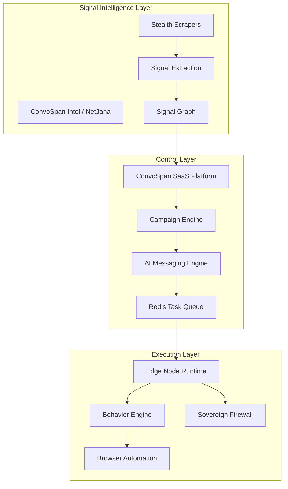

# ConvoSpan Sovereign Alpha

## Master System Architecture

## Overview

ConvoSpan is a distributed autonomous outreach platform designed to generate high-veracity B2B opportunities using signal intelligence and sovereign automation.

The system is built around three tightly integrated layers:

1. **ConvoSpan Intel (NetJana)**
   Signal discovery and intelligence extraction.

2. **ConvoSpan SaaS Platform**
   Campaign orchestration and AI decision-making.

3. **ConvoSpan Edge Nodes**
   Physical automation and data sovereignty.

This layered architecture enables scalable outreach while preserving security, compliance, and behavioral realism.

---

# System Architecture



---

# Layer 1: Signal Intelligence (NetJana)

The intelligence layer identifies early signals indicating potential business opportunities.

### Responsibilities

* scrape B2B websites
* detect hiring expansions
* detect facility growth
* detect technology adoption
* detect operational friction

### Key Components

**Stealth Scrapers**

Playwright-based crawlers using proxy mesh and anti-detection behavior.

**Signal Extraction**

AI models extract operational signals and business events.

**Signal Graph**

Signals are converted into a structured graph connecting:

* companies
* people
* technologies
* events

This graph produces **intent scores** used to trigger campaigns.

---

# Layer 2: SaaS Control Platform

The SaaS platform acts as the system’s decision-making brain.

### Responsibilities

* campaign orchestration
* lead management
* AI messaging
* analytics
* billing
* task dispatching

### Core Services

**Campaign Engine**

Creates outreach workflows using DAG-based sequences.

Example workflow:

```
visit profile
→ send connection
→ message
→ follow-up
```

---

**AI Messaging Engine**

Generates context-aware messages using:

* lead profile
* company signals
* RAG knowledge base
* historical campaign learning

---

**Task Dispatch System**

Automation tasks are placed in a Redis queue.

Edge Nodes poll this queue to execute actions.

---

# Layer 3: Edge Execution Layer

Edge Nodes perform platform-facing automation locally.

### Responsibilities

* execute browser automation
* simulate human behavior
* protect PII
* maintain browser sessions

---

## Edge Node Components

### Edge Runtime

Handles:

* node registration
* heartbeat monitoring
* task polling
* result reporting

---

### Behavior Engine

Simulates realistic browsing patterns.

Examples:

```
scroll feed
pause
visit profile
send connection
```

Noise actions are inserted to prevent automation detection.

---

### Browser Automation

Uses Playwright or Puppeteer to perform actions such as:

* visiting profiles
* sending connection requests
* sending messages

Sessions persist locally using cookies.

---

### Sovereign Firewall

Protects sensitive data.

Process:

```
detect PII
→ replace with token
→ store mapping locally
```

Example:

```
Rahul Mehta → PERSON_1
```

The SaaS platform only receives tokenized identifiers.

---

# Data Flow

Typical system lifecycle:

```
scraper detects signal
→ signal graph updated
→ intent score calculated
→ lead qualifies
→ campaign engine generates workflow
→ tasks dispatched
→ edge node executes actions
→ replies classified
→ meeting scheduled
```

---

# AI Agent System

ConvoSpan operates as a multi-agent architecture.

Key agents include:

* Signal Discovery Agent
* Pain Point Analyst
* Lead Qualification Agent
* Campaign Planner
* Message Composer
* Reply Intelligence Agent
* Meeting Conversion Agent
* Safety Sentinel
* Edge Task Executor

These agents collaborate through event-driven workflows.

---

# Security Model

The platform enforces strict sovereignty principles.

### Key Safeguards

**PII Tokenization**

Sensitive data remains on Edge Nodes.

**HMAC Request Signing**

All node communication is verified.

**Multi-Tenant Isolation**

Each organization’s data is partitioned by `organization_id`.

**Compliance Sentinel**

Scraping and automation respect legal and platform policies.

---

# Infrastructure Stack

**Monorepo Structure (`apps/`)**:
- `apps/web`: Next.js frontend (static export)
- `apps/api`: Fastify API server
- `apps/edge-fastapi`: Python FastAPI edge node

### Frontend (`apps/web`)

```
React / Next.js (Static Export)
Tailwind
Framer Motion
```

---

### Backend API (`apps/api`)

```
Node.js / Fastify
Redis / BullMQ
PostgreSQL / Prisma
```

---

### Intelligence

```
Playwright
Gemini AI
Vector RAG
Signal Graph
```

---

### Edge Nodes

```
Python FastAPI
llama.cpp
Presidio
Playwright
Docker
```

---

# Deployment Architecture

```
GitHub
  ↓
GitHub Actions
  ↓
Docker Images
  ↓
Runtime Environments
```

SaaS deployment:

```
Vercel
```

Edge Node deployment:

```
Docker on local hardware
```

Intel workers:

```
Cloud worker clusters
```

---

# Competitive Advantage

The platform differentiates itself through:

### Signal-Driven Outreach

Campaigns are triggered by real operational signals.

---

### Sovereign Automation

Execution occurs on Edge Nodes rather than centralized servers.

---

### Behavioral Simulation

Automation mimics human browsing patterns.

---

### Intelligence Feedback Loop

Campaign results improve signal detection and messaging strategies.

---

# Future Roadmap

Planned improvements include:

* buyer committee graph modeling
* reinforcement learning for campaigns
* predictive intent modeling
* autonomous opportunity discovery
* distributed edge node fleets

---

# System Vision

ConvoSpan aims to create a fully autonomous B2B opportunity discovery and outreach platform capable of:

* detecting business expansion signals
* identifying relevant decision makers
* initiating conversations
* converting interest into meetings

All while maintaining compliance, security, and human-like interaction patterns.
