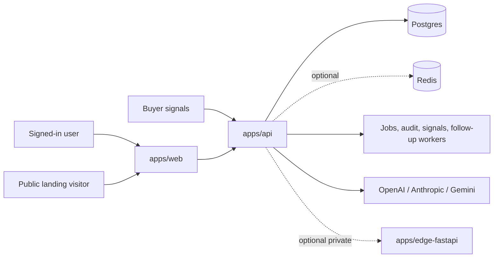

# CraftMyFunnel

CraftMyFunnel is a multi-app monorepo for AI-assisted outbound operations, landing-page funnels, buyer-signal review, and team governance. The repo ships three deployable services with shared contracts and shared operational docs.

## Current Status

As of **June 2, 2026**:

- `apps/api` production-readiness audit: **100/100**
- broader launch readiness: **not fully green yet**
- biggest remaining risk: the web coverage lane is **not stable** in the current tree
- GitHub Actions still need a fresh confirmed green run after the latest local fixes

That means the platform is in good shape for controlled beta work, but not yet at the confidence bar for broad production traffic.

## Monorepo Layout

| Path | Service | Role |
| --- | --- | --- |
| `apps/web` | Next.js app | Marketing pages, authenticated product UI, public landing pages, selected route handlers |
| `apps/api` | Fastify app | Core API, workers, Prisma access, webhooks, AI runtime integration, readiness checks |
| `apps/edge-fastapi` | FastAPI edge runtime | Optional private execution service for edge or hardware-backed tasks |
| `packages/toon-core` | Shared package | Shared serialization/helpers for AI context handling |
| `docs/*` | Docs | Architecture, readiness, deployment, QA, and implementation records |

## Runtime Topology



## What The Product Actually Does Today

The safe description is:

- helps teams manage outreach campaigns, leads, approvals, landing funnels, and setup
- ingests buyer-intent signals and turns them into review-ready follow-up context
- supports AI-assisted drafting and analysis with centralized guardrails and credit enforcement
- tracks landing-page leads and events
- keeps governance, audit, and feature gating inside the runtime path

The docs and UI should avoid stronger claims such as guaranteed meetings, fully autonomous outreach, or outcome-based billing unless the implementation is explicitly verified.

## Local Development

Install dependencies from the repo root:

```bash
npm install
```

Start the local beta stack:

```bash
npm run beta:start
```

This brings up or reuses:

- Postgres
- Redis
- `apps/web`
- `apps/api`

To include the optional edge runtime:

```bash
npm run beta:start:all
```

## Verification Commands

Useful local checks:

```bash
npm run readiness:audit --workspace apps/api
npm run lint --workspace apps/web
npm run test:coverage --workspace apps/web
npm run test:e2e --workspace apps/web -- e2e/auth.spec.ts e2e/dashboard.spec.ts
```

## Readiness Snapshot

The repo is not judged by the API readiness audit alone.

### Green

- required local runtime stack boots with Docker-backed Postgres and Redis
- API readiness audit passes at `100/100`
- architecture is cleanly split by service boundary
- edge runtime is optional and can remain private
- AI guardrails, team scoping, and landing sanitization are present in the active code path

### Still Blocking Broader Launch

- web coverage is currently flaky in this tree: `health-route`, `metrics-route`, and `worker-dispatch` tests timed out during reassessment
- no newly confirmed green GitHub Actions run for `CI`, `Playwright`, and `docker-ghcr` after the latest local changes
- dependency security debt remains, especially in the API dependency graph
- some older docs previously described a stale managed-runtime/control-plane architecture and have now been corrected

## Deployment Model

Deploy each app separately from this monorepo:

| Service | Root | Visibility |
| --- | --- | --- |
| Web | `apps/web` | Public |
| API | `apps/api` | Public |
| Edge | `apps/edge-fastapi` | Private/internal |
| Postgres | Managed service | Private |
| Redis | Managed service | Private, optional |

Path-based deploy triggers should remain the norm:

- `apps/web/**` -> web deploy
- `apps/api/**` -> API deploy
- `apps/edge-fastapi/**` -> edge deploy

Shared root changes such as lockfile, root scripts, or schema changes should trigger deploys for impacted services.

## Source Of Truth Docs

- [MASTER_SYSTEM_ARCHITECTURE.md](./MASTER_SYSTEM_ARCHITECTURE.md)
- [docs/ARCHITECTURE.md](./docs/ARCHITECTURE.md)
- [docs/README.md](./docs/README.md)
- [docs/PRODUCTION_READINESS_ASSESSMENT_2026-06-02.md](./docs/PRODUCTION_READINESS_ASSESSMENT_2026-06-02.md)
- [docs/context/ARCHITECTURE.md](./docs/context/ARCHITECTURE.md)
- [docs/context/LAUNCH_READINESS.md](./docs/context/LAUNCH_READINESS.md)

## Chrome Extension Release Plan

### V1.0.0

- Minimal LinkedIn Assistant.
- Runs only on LinkedIn pages.
- User-triggered only.
- Reads visible profile/company/search information after user action.
- Saves selected data to CraftMyFunnel workspace.
- No automated outreach.

### V2.0.0

- Advanced workflow features may be added later after approval.
- Any additional permissions will be requested through an update to the same Chrome Web Store listing.
- No separate duplicate extension will be created.
