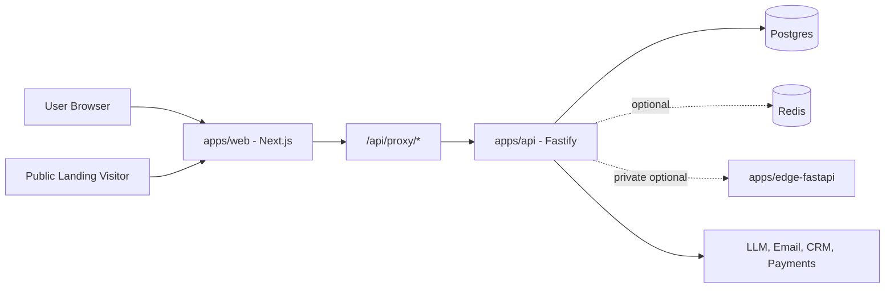

# ConvoSpan

ConvoSpan is a multi-app monorepo for AI-assisted outbound, campaign operations, landing-page funnels, governance, and launch-readiness workflows.

The repository is organized as one codebase with multiple deployable services. The root is orchestration only: scripts, shared config, CI, and documentation.

## What This Repo Contains

| Path | Service | Purpose |
| --- | --- | --- |
| `apps/web` | Next.js web app | Marketing pages, authenticated dashboard, setup wizard, public landing pages, and web route handlers |
| `apps/api` | Fastify API app | Core backend APIs, workers, Prisma access, auth-aware route adapter, landing-agent APIs |
| `apps/edge-fastapi` | FastAPI edge runtime | Optional private edge execution service |
| `packages/*` | Shared packages | Shared contracts, helpers, and cross-app code |
| `docs/*` | Documentation | Architecture, setup, runbooks, diagrams, and implementation notes |

## System Architecture

For the full GitHub-renderable Mermaid architecture, see [docs/architecture-diagram.md](./docs/architecture-diagram.md).



## Product Surfaces

- Outreach campaigns, leads, analytics, approvals, and inbox workflows.
- Landing Agent funnel builder with prompt intake, brief generation, wireframes, constrained editor, public publish path, lead capture, and event tracking.
- Setup wizard for brand, email, AI, LinkedIn extension, readiness, and launch configuration.
- Governance, audit, feature gating, team settings, and approval controls.
- Optional private edge runtime for hardware or browser-backed execution.

## Local Development

Install dependencies from the repository root:

```bash
npm install
```

Start the local beta stack:

```bash
npm run beta:start
```

This starts or reuses Postgres, Redis, `apps/web`, and `apps/api`, then pushes the API Prisma schema to the local database.

Start web, API, and optional edge runtime:

```bash
npm run beta:start:all
```

## Build And Verification

```bash
npm run build:web
npm run build:api
npm run typecheck:web
npm run typecheck:api
```

App-level checks are available from each workspace:

```bash
cd apps/web
npm run test:unit
npm run test:e2e

cd ../api
npm run typecheck
```

## Repository Structure

```text
fullstack/
|-- apps/
|   |-- web/                 # Next.js web app
|   |-- api/                 # Fastify API service
|   |-- edge-fastapi/        # Optional private edge runtime
|
|-- packages/                # Shared packages and contracts
|-- docs/                    # Documentation, diagrams, runbooks
|-- scripts/                 # Repository orchestration scripts
|-- docker/                  # Docker support files
|-- .github/                 # GitHub Actions workflows
|
|-- docker-compose.yml       # Local infrastructure and services
|-- MASTER_SYSTEM_ARCHITECTURE.md
|-- README.md
|-- package.json             # Workspace scripts
|-- package-lock.json
```

See [docs/SIMPLE_REPO_TREE.md](./docs/SIMPLE_REPO_TREE.md) for the expanded service map.

## Deployment Model

Deploy each app as a separate service from this single repository:

| Service | Root directory | Visibility |
| --- | --- | --- |
| Web | `apps/web` | Public |
| API | `apps/api` | Public |
| Edge | `apps/edge-fastapi` | Private/internal, optional |
| Postgres | Managed database | Private |
| Redis | Managed cache/queue | Private, optional |

Use path-based deploy triggers:

- `apps/web/**` deploys web.
- `apps/api/**` deploys API.
- `apps/edge-fastapi/**` deploys edge.
- Shared changes such as `package-lock.json`, root scripts, or Prisma schema changes deploy affected services.

## Documentation Map

- [Master system architecture](./MASTER_SYSTEM_ARCHITECTURE.md)
- [Mermaid architecture diagram](./docs/architecture-diagram.md)
- [Landing Agent architecture](./docs/landing-agent-architecture.md)
- [Landing Agent API examples](./docs/landing-agent-api-examples.md)
- [Repository structure](./docs/SIMPLE_REPO_TREE.md)
- [Deployment runbook](./docs/DEPLOYMENT_RUNBOOK.md)
- [CI verification](./docs/CI_VERIFICATION.md)
- [Setup guide](./docs/SETUP.md)

## Infrastructure Expectations

- Postgres is required for real runtime functionality.
- Redis is optional for cache and queue features; the app should boot without Redis unless a specific workflow provisions it.
- CI jobs that need Postgres or Redis should define GitHub Actions `services:` containers and run `prisma db push` before integration tests.
- Edge runtime is optional for the email-first beta and should remain private unless explicitly exposed.

