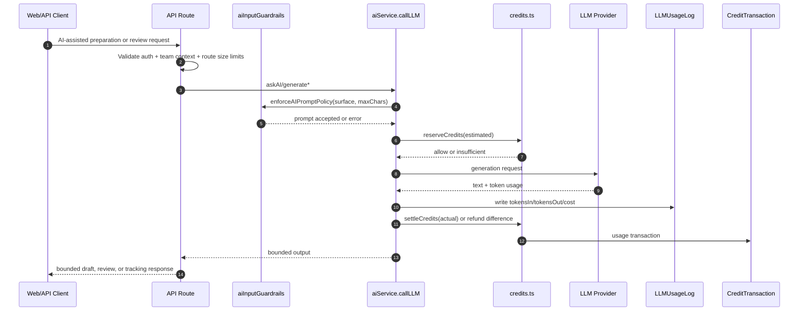

# AI Guardrails, Token Usage, And Credit Enforcement (2026-04)

This document defines the active guardrail and billing contract for AI generation in `apps/api`.

It covers:

- prompt safety controls
- input/output size controls
- strict credit reservation and settlement for chargeable team contexts
- token and cost logging
- route-level behavior and status codes
- customer-facing claim guardrails for AI-assisted growth workflows

## Runtime Contract

All user-facing AI generation should flow through:

- `apps/api/src/lib/aiService.ts`

Prompt safety and input constraints are centralized in:

- `apps/api/src/lib/aiInputGuardrails.ts`

Public-facing copy and generated content must describe the product as AI-assisted preparation, review, and tracking unless a deeper workflow is implemented and verified. Avoid claims that CraftMyFunnel guarantees qualified meetings, delivers qualified pipeline outcomes, fully automates outreach, or charges on outcomes. Safer language is "supports", "prepares", "tracks", "review-ready", and "human approval controls".

## Mermaid (Merlin) Flow

## Surface Prompt Limits

| Surface | Max prompt chars |
| --- | --- |
| `CHAT` | `5000` |
| `HELPER` | `4500` |
| `EMAIL` | `7000` |
| `LANDING` | `9000` |
| `GENERIC` | `6000` |

Blocked prompt classes include:

- instruction override attempts (`ignore/disregard/bypass previous instructions`)
- system prompt extraction and jailbreak language
- script payload signatures (`<script>`, `javascript:`, event-handler injection)
- high-risk malicious instruction patterns
- excessive outbound link stuffing

## Output Bounds

For non-JSON generation responses:

| Surface | Max output chars |
| --- | --- |
| `CHAT` | `2500` |
| `HELPER` | `3500` |
| `EMAIL` | `2800` |
| `LANDING` | `12000` |
| `GENERIC` | `5000` |

For JSON mode (`expectsJson: true`):

- response is not string-clamped (to avoid corrupting JSON)
- hard fail if JSON text exceeds `60000` chars

## Route-Level Hard Limits

The following routes enforce additional payload bounds:

| Route | Main limits |
| --- | --- |
| `routes/ai/preview` | goal/context/prompt bounded; authenticated team required |
| `routes/ai/improve` | email improvement input max `4000` chars |
| `routes/ai/execute` | team context required for AI actions |
| `routes/email/compose` | serialized compose input max `9000` chars |
| `routes/email/send` | subject max `160`, html max `25000` |
| `routes/inbox/suggest` | context max `5000`, lead must belong to team |
| `routes/inbox/[id]/suggest` | context max `5000`, lead must belong to team |
| `routes/inbox/reply` | outbound content max `2200` |
| `modules/landing-agent/schemas` | prompt, asset, event payload constraints tightened |

## Credit Enforcement Contract

Credit enforcement is applied inside AI generation, not only at route edges:

1. estimate required credits from prompt size and task complexity
2. reserve estimated credits with an atomic conditional debit
3. perform provider call
4. log token usage and cost (`LLMUsageLog`)
5. settle actual usage by charging the delta or refunding the difference
6. write ledger activity in `CreditTransaction`

Behavior:

- insufficient credits returns an error and routes map it to `402`
- strict charging applies when team context is a valid UUID
- non-chargeable internal contexts are excluded from billing
- failed provider calls trigger credit rollback for reserved usage

## Embedding Requests

Embedding requests now follow the same guarded runtime path:

- input is validated through `enforceAIPromptPolicy(...)` with explicit embedding length bounds
- usage is logged to `LLMUsageLog`
- chargeable team contexts reserve and settle credits for embedding calls
- `/routes/ai/execute` validates embedding input before dispatch

## Token And Cost Tracking

Token and cost tracking is written to `LLMUsageLog`:

- `tokensIn`
- `tokensOut`
- provider and model
- estimated cost
- latency
- success/failure

Credit deductions are written to `CreditTransaction` as usage rows.

## Email Composer Guardrails

`modules/email-campaigner/service/emailComposer.ts` now enforces:

- per-node serialized input budgets
- prompt-policy checks before generation
- bounded output fields (subject/body/reasoning/internal notes)
- credits charged through `aiService` for each generation call
- generated copy should be review-ready and must not promise guaranteed outcomes, automatic meeting booking, or fully autonomous execution

## Landing Agent Guardrails

`modules/landing-agent` now enforces:

- stricter campaign prompt bounds
- stricter asset text bounds
- bounded public event and lead payload size
- AI brief/wireframe generation routed with explicit landing surface context
- stored HTML is sanitized before public render to reduce stored-XSS exposure
- landing copy should be described as campaign funnel support unless conversion attribution is explicitly implemented for the surface

## Related Files

- `apps/api/src/lib/aiInputGuardrails.ts`
- `apps/api/src/lib/aiService.ts`
- `apps/api/routes/ai/execute/route.ts`
- `apps/api/routes/ai/improve/route.ts`
- `apps/api/routes/ai/preview/route.ts`
- `apps/api/routes/email/compose/route.ts`
- `apps/api/routes/email/send/route.ts`
- `apps/api/routes/inbox/suggest/route.ts`
- `apps/api/routes/inbox/[id]/suggest/route.ts`
- `apps/api/routes/inbox/reply/route.ts`
- `apps/api/src/modules/email-campaigner/service/emailComposer.ts`
- `apps/api/src/modules/landing-agent/schemas.ts`
- `apps/api/src/modules/landing-agent/service.ts`
