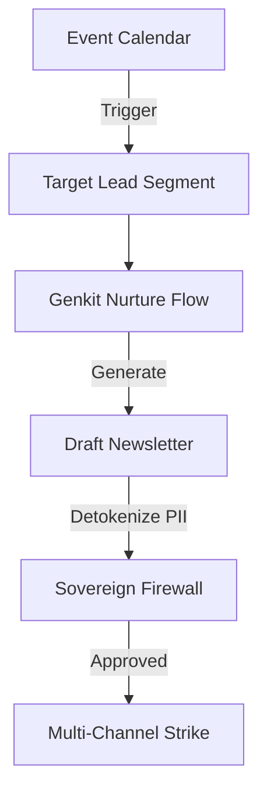

# Sovereign Growth: Lead Nurturing Workflow

This document outlines the high-frequency lead engagement engine within CraftMyFunnel Edge, leveraging autonomous AI agents, a synchronized 2026 event calendar, and a secure, fail-closed detokenization layer.

## 🏗 Architectural Blueprint

The workflow follows a 4-stage "Plan-Fetch-Generate-Execute" cycle:

### 1. The Autonomous Calendar (Planning)
The `CalendarEvent` and `Newsletter` models store high-value touchpoints (holidays, summits, cultural events). Each event is mapped to a `leadGenAngle` which dictates the tone and objective of the outreach.

### 2. Segment Identification (Fetching)
AI agents query the database to identify leads whose tags, industry, or past interactions align with the upcoming event. 
- *Example*: An "AI Impact Summit" event targets leads with the `Tech` or `Investor` tag.

### 3. Crystalline Generation (AI Processing)
Using the `calendarNurtureFlow`, Genkit invokes the `gemini-1.5-flash` model to:
- Contextualize the `emailBodyHtml` for the specific lead.
- Ensure the `subjectLine` avoids spam filters while maintaining high curiosity.
- Include a soft CTA designed for relationship building.

### 4. Sovereign Execution (Security)
Before any email is sent, the `SovereignFirewall` ensures:
- All detokenized PII (FullName, Email) is correctly unmasked using the user's `HARDWARE_SIGNATURE`.
- The content is scrutinized for hallucinations or compliance risks.
- The transmission occurs via the Edge Node, ensuring zero-leak of PII to central logs.

## 🚀 Scalability Considerations
- **Async Batching**: Newsletter generation for thousands of leads is handled asynchronously via the `JobQueue`.
- **Relational Integrity**: 1:1 mapping between events and templates ensures consistency across high-volume strikes.
- **Index Optimization**: Composite indices on `eventName` and `eventDate` ensure rapid retrieval for dashboard visualization.

## 🛠 Manual Overrides (HITL)
While autonomous, every newsletter can be viewed and tweaked via the **Command Center** before final execution, ensuring Human-in-the-Loop governance.
