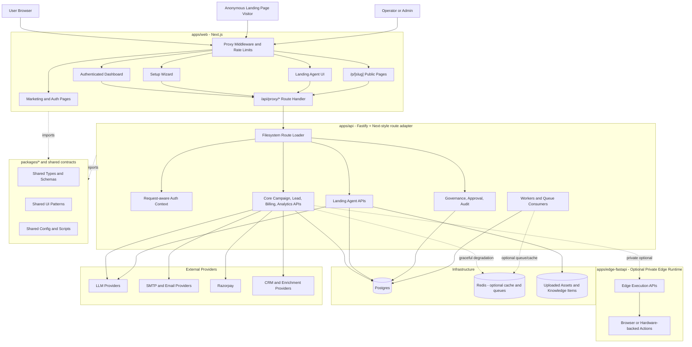
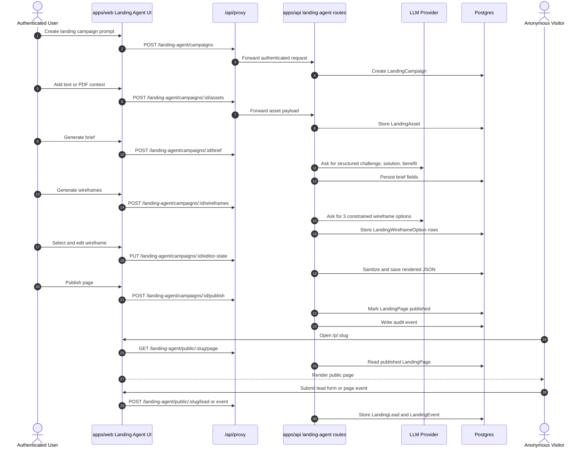

# ConvoSpan Architecture Diagram

This file is GitHub-renderable Mermaid. Copy any fenced `mermaid` block into the Mermaid Live Editor if you need an exported SVG or PNG.

## Platform Runtime

## Landing Agent Funnel

