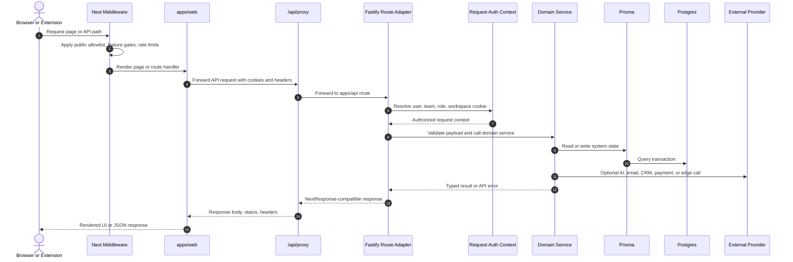
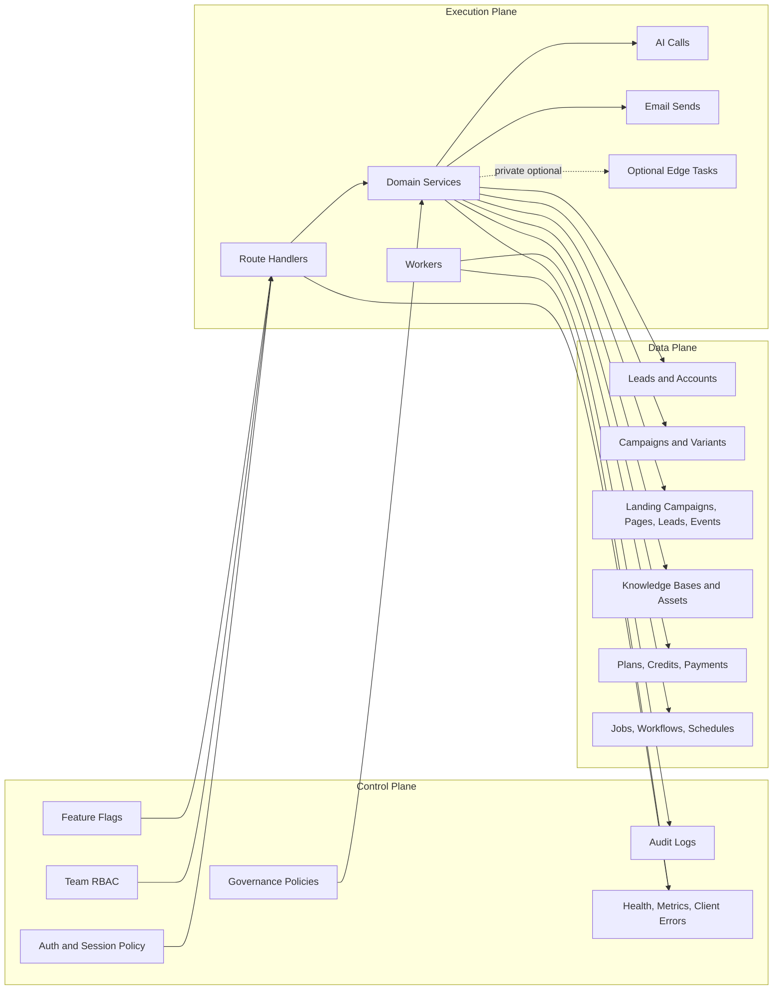
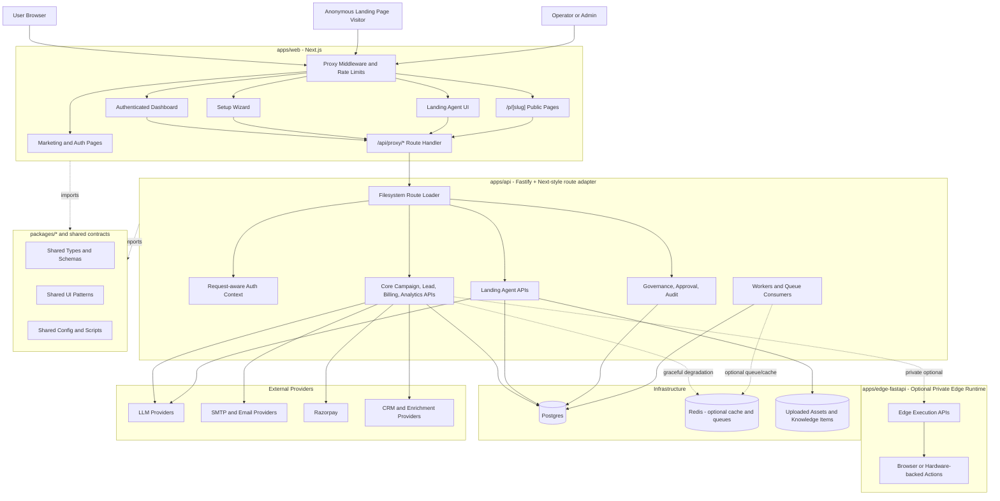
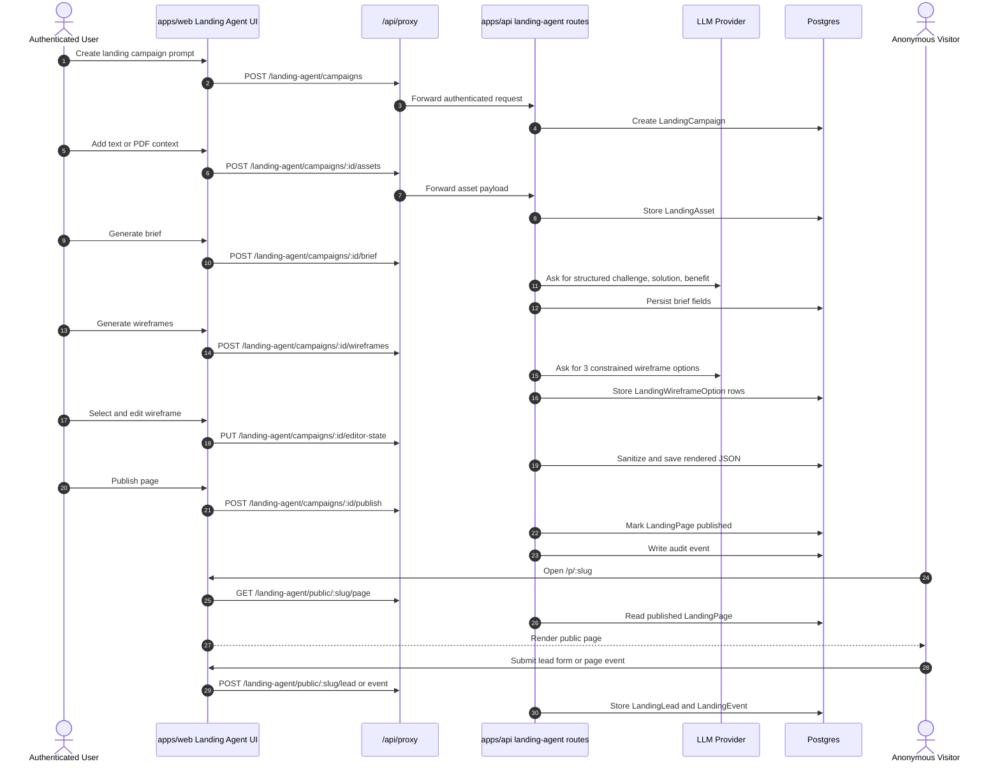

# ConvoSpan Architecture Diagram

This file is GitHub-renderable Mermaid. Copy any fenced `mermaid` block into the Mermaid Live Editor if you need an exported SVG or PNG.

## Layered System Design

```mermaid
flowchart TB
    subgraph L0["Layer 0 - Actors and Channels"]
        browser[Authenticated Browser User]
        visitor[Anonymous Landing Visitor]
        operator[Internal Operator]
        extension[Chrome Extension Operator]
        webhook[External Webhook Sender]
    end

    subgraph L1["Layer 1 - Delivery and Routing"]
        webIngress[Web Ingress]
        nextMiddleware[Next Proxy Middleware]
        publicRoutes[Public Route Allowlist]
        apiProxy["Web /api/proxy/*"]
        corsRateLimit[CORS and Rate Limit Controls]
    end

    subgraph L2["Layer 2 - Web Experience"]
        marketing[Marketing Pages]
        authPages[Auth and Account Pages]
        dashboard[Dashboard Shell]
        setupWizard[Setup Wizard]
        campaignUi[Campaign UI]
        landingAgentUi[Landing Agent UI]
        publishedPages["Published Pages /p/:slug"]
    end

    subgraph L3["Layer 3 - API Runtime Boundary"]
        fastify[Fastify Server]
        routeLoader[Filesystem Route Loader]
        routeAdapter[Next-style Route Adapter]
        requestAuth[Request-aware Auth Context]
        responseBridge[Response and Cookie Bridge]
    end

    subgraph L4["Layer 4 - Application Services"]
        campaignApis[Campaign APIs]
        landingApis[Landing Agent APIs]
        setupApis[Setup APIs]
        billingApis[Billing APIs]
        analyticsApis[Analytics APIs]
        extensionApis[Extension APIs]
        adminApis[Admin APIs]
    end

    subgraph L5["Layer 5 - Domain Modules"]
        campaigns[Campaign Domain]
        leads[Lead Domain]
        landingAgent[Landing Agent Domain]
        rag[RAG and Knowledge Domain]
        workflows[Workflow Domain]
        inbox[Inbox Domain]
        governance[Governance Domain]
        settings[Settings Domain]
    end

    subgraph L6["Layer 6 - AI and Automation"]
        promptBuilders[Prompt Builders]
        modelGateway[Model Gateway]
        guardrails[Guardrails and Policy Checks]
        eventStore[Learning Event Store]
        workers[Workers and Schedulers]
        adapters[Buyer Intel, Enrichment, Outreach Adapters]
    end

    subgraph L7["Layer 7 - Data Access and Persistence"]
        prisma[Prisma Client]
        postgres[(Postgres)]
        redis[(Redis Optional)]
        knowledge[(Knowledge Items and Assets)]
        audit[(Audit and System Events)]
    end

    subgraph L8["Layer 8 - External Integrations"]
        llm[LLM Providers]
        smtp[SMTP and Email Providers]
        payments[Razorpay]
        crm[CRM and Enrichment Providers]
        browserNode[Browser Automation Node]
    end

    subgraph L9["Layer 9 - Optional Private Edge"]
        edgeApi[FastAPI Edge Runtime]
        hardware[Hardware or Private Execution Context]
    end

    browser --> webIngress
    visitor --> webIngress
    operator --> webIngress
    extension --> webIngress
    webhook --> webIngress

    webIngress --> nextMiddleware
    nextMiddleware --> publicRoutes
    nextMiddleware --> corsRateLimit
    corsRateLimit --> marketing
    corsRateLimit --> authPages
    corsRateLimit --> dashboard
    corsRateLimit --> setupWizard
    corsRateLimit --> campaignUi
    corsRateLimit --> landingAgentUi
    corsRateLimit --> publishedPages

    dashboard --> apiProxy
    setupWizard --> apiProxy
    campaignUi --> apiProxy
    landingAgentUi --> apiProxy
    publishedPages --> apiProxy
    extension --> apiProxy

    apiProxy --> fastify
    fastify --> routeLoader
    routeLoader --> routeAdapter
    routeAdapter --> requestAuth
    routeAdapter --> responseBridge

    requestAuth --> campaignApis
    requestAuth --> landingApis
    requestAuth --> setupApis
    requestAuth --> billingApis
    requestAuth --> analyticsApis
    requestAuth --> extensionApis
    requestAuth --> adminApis

    campaignApis --> campaigns
    landingApis --> landingAgent
    setupApis --> settings
    billingApis --> settings
    analyticsApis --> campaigns
    extensionApis --> workflows
    adminApis --> governance

    campaigns --> promptBuilders
    landingAgent --> promptBuilders
    rag --> modelGateway
    workflows --> workers
    inbox --> eventStore
    governance --> guardrails
    landingAgent --> adapters

    promptBuilders --> modelGateway
    modelGateway --> guardrails
    workers --> eventStore
    adapters --> eventStore

    campaigns --> prisma
    leads --> prisma
    landingAgent --> prisma
    rag --> prisma
    workflows --> prisma
    governance --> prisma
    settings --> prisma

    prisma --> postgres
    workers -. cache and queues .-> redis
    modelGateway --> llm
    campaignApis --> smtp
    billingApis --> payments
    adapters --> crm
    landingAgent --> knowledge
    governance --> audit

    extensionApis -. optional private execution .-> edgeApi
    edgeApi --> hardware
    edgeApi --> browserNode
```

## Layer Responsibilities

| Layer | Name | Responsibilities |
| --- | --- | --- |
| 0 | Actors and Channels | Browser users, anonymous visitors, operators, extension users, webhook senders |
| 1 | Delivery and Routing | Public path allowlist, API proxying, middleware, CORS, rate limits, route protection |
| 2 | Web Experience | Next.js pages, dashboard shells, setup wizard, landing-agent UI, public landing rendering |
| 3 | API Runtime Boundary | Fastify server, route loading, dynamic route params, response header/cookie bridge |
| 4 | Application Services | Route handlers and app-level service surfaces grouped by product area |
| 5 | Domain Modules | Campaigns, leads, landing-agent, knowledge, workflows, inbox, governance, settings |
| 6 | AI and Automation | Prompt construction, model gateway, guardrails, adapters, workers, event store |
| 7 | Data Access and Persistence | Prisma, Postgres, optional Redis, knowledge assets, audit/system events |
| 8 | External Integrations | LLMs, email, payments, CRM/enrichment, browser automation providers |
| 9 | Optional Private Edge | Edge FastAPI, private execution context, browser or hardware-backed tasks |

## Request Lifecycle

## Control Plane And Data Plane

## Platform Runtime

## Landing Agent Funnel

