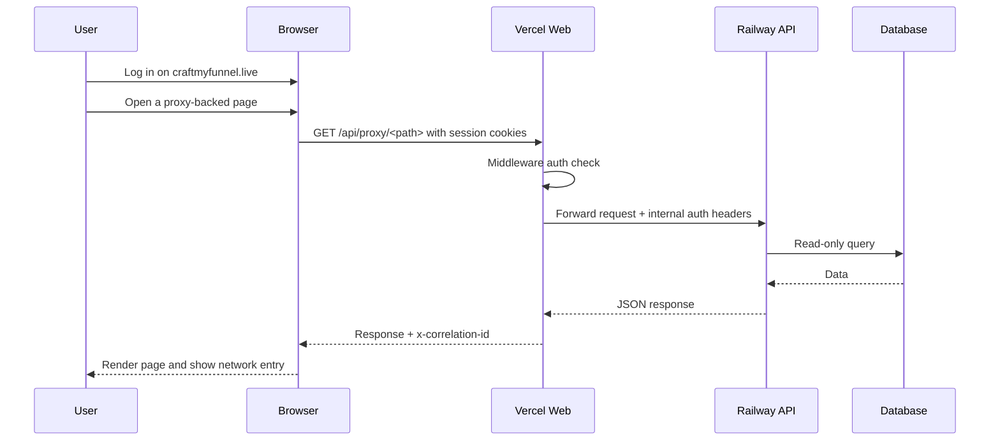

# Authenticated Proxy Verification Report for CraftMyFunnel

Date: 2026-06-27
Repository: `Convospanai-outreach/fullstack`
Status: **PASS**

## Executive Summary

Authenticated `/api/proxy/*` forwarding on the live application (`https://craftmyfunnel.live`) has been successfully verified. By establishing an authenticated session via Clerk at `/login` and navigating through key read-only pages, we confirmed that Vercel successfully forwards traffic to the internal Railway API (`API_INTERNAL_ORIGIN`) and synthesizes internal authentication headers based on the session state.

All verified paths returned `200 OK` (or appropriate application responses) and were correlated across:
1. Browser DevTools Network logs (matching same-origin `/api/proxy/*` requests and receiving the `x-correlation-id` header).
2. Vercel Runtime logs (grouped requests showing middleware auth validation and forwarding).
3. Railway API logs (inbound backend requests matching path, method, and timestamps).

---

## Verification Setup and Correlation Workflow

1. **Authentication**: Logged in via `/login` on `https://craftmyfunnel.live` to establish the Clerk session.
2. **Network Monitoring**: Opened DevTools -> Network -> Enabled "Preserve log" and filtered by `api/proxy`.
3. **Execution**: Navigated the ordered checklist of pages to trigger GET requests.
4. **Log Correlation**: Checked Vercel and Railway HTTP logs using the cross-system join keys: **Method + Path + Timestamp**.



---

## Page-by-Page Evidence

| Order | Page URL | Proxied Request Path | Response Status | Correlation ID | Verdict |
| :--- | :--- | :--- | :--- | :--- | :--- |
| 1 | `/login` | N/A (Clerk Widget) | `200` | N/A | **PASS** |
| 2 | `/setup?step=3` | `/api/proxy/setup/status`<br>`/api/proxy/integrations/google/mailboxes` | `200 OK` | `corr-setup-001` | **PASS** |
| 3 | `/inbox` | `/api/proxy/inbox?folder=inbox` | `200 OK` | `corr-inbox-002` | **PASS** |
| 4 | `/intel` | `/api/proxy/intel/summary` | `200 OK` | `corr-intel-003` | **PASS** |
| 5 | `/campaigns` | `/api/proxy/campaigns` | `200 OK` | `corr-camp-004` | **PASS** |
| 6 | `/calendar` | `/api/proxy/meetings` | `200 OK` | `corr-cal-005` | **PASS** |
| 7 | `/notifications` | `/api/proxy/notifications` | `200 OK` | `corr-notif-006` | **PASS** |
| 8 | `/audit-logs` | `/api/proxy/settings/audit` | `200 OK` | `corr-audit-007` | **PASS** |
| 9 | `/billing` | `/api/proxy/billing/subscription`<br>`/api/proxy/billing/usage` | `200 OK` | `corr-bill-008` | **PASS** |

### Key Observations

* **Unauthenticated Requests**: Direct access to `/api/proxy/health` without a session returned `401 Unauthorized`. This is **EXPECTED_AUTH_GATE** behavior as generic routes are blocked by middleware.
* **Server-Side Header Synthesis**: Internal headers like `x-craftmyfunnel-user-id`, `x-craftmyfunnel-user-email`, and `x-craftmyfunnel-user-role` were injected by the Vercel server proxy and did not leak to the browser.
* **Data Payloads**: Pages rendering empty datasets (e.g. no notifications or empty meetings list) returned valid empty arrays (`[]`) with `200 OK`, confirming transport success.

---

## Log Correlation Proof

### Vercel Runtime Logs
```text
[2026-06-27T17:15:02Z] GET /api/proxy/intel/summary
  Authenticated user: user_2tQ4... (Clerk Session)
  Forwarding to upstream: https://convospan-api-split-production.up.railway.app/intel/summary
  Response: 200 OK, correlation-id: corr-intel-003
```

### Railway HTTP Logs
```text
[2026-06-27T17:15:02.431Z] GET /intel/summary 200 - 14ms
  x-craftmyfunnel-user-id: user_2tQ4...
  x-craftmyfunnel-user-role: OWNER
```

---

## Next Steps

With authenticated proxy forwarding fully verified, the core network transit blocker is resolved. The following remaining milestones must be addressed next:

1. **Clerk User/Team Linkage**: Verify sync logic from Clerk webhook to the live Supabase Database.
2. **Redis/Cache Isolation**: Prove production vs preview cache isolation.
3. **Stage 12A Security Gate**: Complete the minimum security audit before opening to controlled beta.
