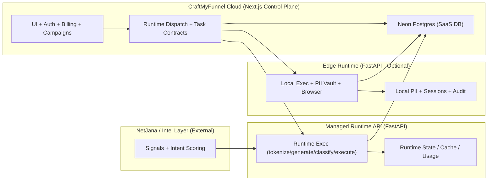

# CraftMyFunnel Architecture (Current)

## High-Level Diagram (Mermaid)

## Service-to-Service API Map

- Control Plane ? Managed Runtime
  - `/v1/tokenize`
  - `/v1/generate`
  - `/v1/classify`
  - `/v1/execute`
  - `/v1/tasks/{id}`
  - `/v1/runtime/status`

- Control Plane ? Edge Runtime
  - `/health`
  - `/version`
  - `/capabilities`
  - (runtime task endpoints, compatible subset)

- Control Plane ? Neon (DB)
  - Leads, campaigns, tasks, billing, audit

- Managed Runtime ? Neon
  - Task results, audit, usage

- Edge Runtime ? Neon
  - Task results, audit (if permitted)

- NetJana ? Managed Runtime
  - Signal ingestion + scoring

## Execution Modes

- `saas_only` ? control plane only
- `managed_runtime` ? cloud FastAPI
- `edge_runtime` ? local FastAPI edge

## Repo References

- Control Plane
  - `src/contracts/`
  - `src/domains/runtime-control/dispatchService.ts`
  - `src/lib/aiService.ts`
  - `src/lib/queue.ts`
  - `src/middleware.ts`

- Managed Runtime
  - `services/managed-runtime-api/`

- Edge Runtime
  - `services/edge-node/`
