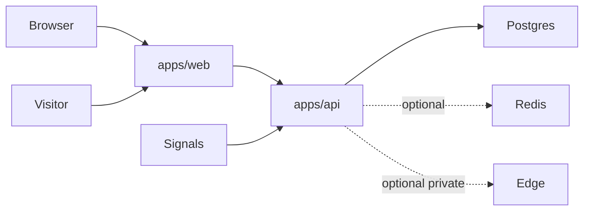

# CraftMyFunnel Architecture Wiki

## Short Version

CraftMyFunnel currently runs as a three-app monorepo:

- `apps/web` - public Next.js UI
- `apps/api` - public Fastify API and worker runtime
- `apps/edge-fastapi` - optional private FastAPI edge runtime

The required launch path is **web + API + Postgres**. Redis is recommended but optional. Edge is optional and should stay private unless there is a deliberate reason to expose it.

## Current Flow

## Ownership Rules

### Web owns

- marketing
- dashboard
- setup flows
- public landing rendering
- browser-facing auth/session UX

### API owns

- business mutations
- Prisma/data access
- workers
- webhooks
- governance and audit
- AI runtime enforcement
- readiness, health, and metrics

### Edge owns

- optional isolated execution
- hardware or browser-adjacent private work

## Product Positioning Guardrail

Describe the product as helping teams prepare, review, manage, and track outreach and landing workflows.

Do not describe the current system as guaranteeing meetings, fully autonomously running outreach, or charging only on outcomes unless those claims are implemented and verified.

## Current Readiness Read

### Strong

- API readiness audit can pass at `100/100`
- core service boundaries are clear
- AI generation has centralized guardrails and billing hooks

### Weak

- web coverage is currently flaky in this working tree
- fresh GitHub green runs still need confirmation
- dependency security debt remains

## Source Of Truth

For longer versions, use:

- `README.md`
- `MASTER_SYSTEM_ARCHITECTURE.md`
- `docs/ARCHITECTURE.md`
- `docs/PRODUCTION_READINESS_ASSESSMENT_2026-06-02.md`
