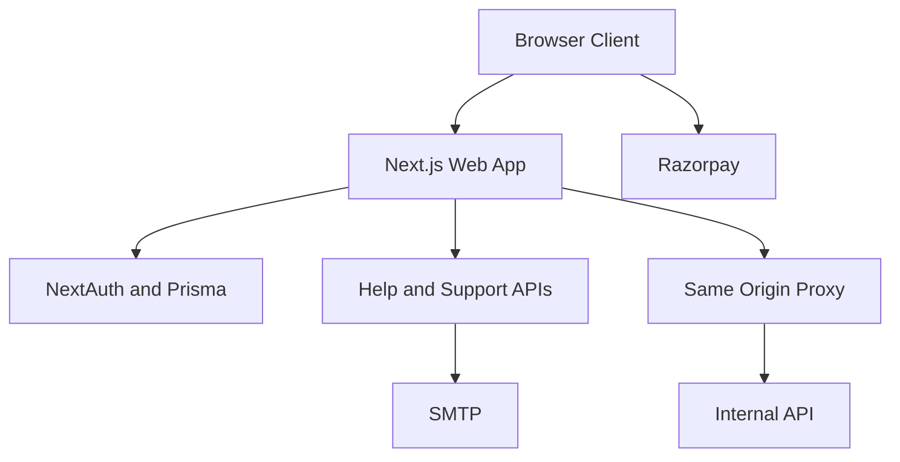

## Executive summary
The highest-risk web themes are boundary drift and script trust. The web app intentionally front-loads many protected and public flows through a single Next.js surface; the generic same-origin proxy is now auth-gated, but the proxy boundary still remains security-critical because selected proxied auth/webhook prefixes are public and future prefix drift would immediately widen exposure. Combined with an always-relaxed CSP (`'unsafe-inline'` and `'unsafe-eval'`) and dynamic third-party payment script loading, the main risks are account takeover pressure against auth entry points, proxy-boundary regression, and high-impact XSS or supply-chain compromise on payment and session-bearing pages.

## Scope and assumptions
- In scope: `apps/web/src/**`, `apps/web/.env.example`, and the public web runtime boundaries they declare.
- Out of scope: implementation details inside `apps/api/**`, `apps/edge-fastapi/**`, worker internals, CI, and legacy archives except where the web app explicitly proxies or depends on them.
- Assumption: the intended deployment is an internet-facing SaaS web app for teams, with authenticated workspaces and public marketing, pricing, contact, and help pages.
- Assumption: `/api/proxy/*` is the default client API path in production because `NEXT_PUBLIC_API_URL` points to `/api/proxy` in `apps/web/.env.example:20`.
- Assumption: protected pages rely on NextAuth JWT sessions and middleware redirects rather than per-page auth checks alone (`apps/web/src/lib/auth.ts:27`, `apps/web/src/middleware.ts:73`).
- Assumption: payment order creation on the downstream API performs server-side validation, because the pricing page only performs a client-side cookie presence check before calling billing checkout (`apps/web/src/app/pricing/page.tsx:14`, `apps/web/src/app/pricing/page.tsx:54`).

Open questions that would materially change ranking:
- Is the split API behind `/api/proxy/*` independently authenticated and authorized on every sensitive route, or is it assuming the web layer already enforced access?
- Are MFA, bot protection, CAPTCHA, WAF, or anti-automation controls deployed in production for auth and support/contact surfaces?
- Is the product truly multi-tenant at the data layer for all proxied routes, or only team-scoped inside selected services?

## System model
### Primary components
- Browser client rendering public marketing, pricing, contact, help, and authenticated workspace pages.
- Next.js web runtime providing page routes, middleware, NextAuth handlers, help/support APIs, and a same-origin proxy (`apps/web/src/middleware.ts:6`, `apps/web/src/app/api/proxy/[...path]/route.ts:28`).
- NextAuth plus Prisma-backed auth/session enrichment for credentials and Google login (`apps/web/src/app/api/auth/[...nextauth]/route.ts:1`, `apps/web/src/lib/auth.ts:27`).
- Internal split API reached through `API_INTERNAL_ORIGIN` and `/api/proxy/*` (`apps/web/.env.example:25`, `apps/web/src/app/api/proxy/[...path]/route.ts:3`).
- External providers for SMTP delivery and Razorpay checkout (`apps/web/src/app/api/contact/route.ts:30`, `apps/web/src/app/pricing/page.tsx:22`).

### Data flows and trust boundaries
- Internet -> Next.js page routes.
  - Data: navigation requests, cookies, user input.
  - Channel: HTTPS.
  - Security guarantees: middleware redirect for protected pages, security headers, CSP, NextAuth session validation.
  - Validation: route-level auth gate in `apps/web/src/middleware.ts:89`.
- Browser -> Next.js auth handlers.
  - Data: email/password credentials, OAuth flows, session cookies.
  - Channel: HTTPS to `/api/auth/*`.
  - Security guarantees: NextAuth, bcrypt password comparison, auth-specific rate limiting in production.
  - Validation: credential presence check and bcrypt compare in `apps/web/src/lib/auth.ts:37`; rate-limit branch in `apps/web/src/middleware.ts:23`.
- Browser -> public help/support routes.
  - Data: search queries, support form PII, free-text support messages.
  - Channel: HTTPS to `/api/help/*` and `/api/support/contact`.
  - Security guarantees: public-route exposure with generic public rate limiting in production.
  - Validation: query required for assistant; email/message validation and HTML escaping for support email bodies in `apps/web/src/app/api/help/assistant/route.ts:49` and `apps/web/src/app/api/support/contact/route.ts:21`.
- Browser -> same-origin proxy -> internal API.
  - Data: cookies, auth headers, JSON bodies, billing requests, application API traffic.
  - Channel: HTTPS to web origin, then server-side fetch to fixed internal origin.
  - Security guarantees: generic proxy traffic is auth-gated by middleware; upstream origin is fixed and recursive-loop prevention exists.
  - Validation: request headers/body are forwarded as-is in `apps/web/src/app/api/proxy/[...path]/route.ts:31`, so downstream authZ still matters for any public proxied prefixes.
- Browser -> Razorpay third-party script.
  - Data: checkout context, billing order identifiers, client-side payment flow data.
  - Channel: browser script load to `https://checkout.razorpay.com`.
  - Security guarantees: CSP allowlist only.
  - Validation: none beyond script load success and downstream order creation in `apps/web/src/app/pricing/page.tsx:22`.
- Next.js web runtime -> Prisma/Redis/SMTP/internal API.
  - Data: user records, plan metadata, session enrichment state, contact/support email content.
  - Channel: DB/cache drivers and server-side HTTP/SMTP.
  - Security guarantees: server-side only access, environment-based configuration.
  - Validation: mixed; sensitive paths rely on server logic and downstream services.

#### Diagram

## Assets and security objectives
| Asset | Why it matters | Security objective (C/I/A) |
| --- | --- | --- |
| Session JWTs and auth cookies | Session theft yields workspace access and privileged API calls | C, I |
| User credentials and password hashes | Credential compromise leads to account takeover | C |
| Billing checkout state and order IDs | Manipulation can affect payment integrity and subscription state | I, A |
| Support/contact PII and message contents | Contains customer identity, business details, and support context | C |
| Internal API surface behind `/api/proxy/*` | Weak downstream auth would expose business operations through the public web origin | C, I, A |
| Governance and key-management pages/routes | Handles secrets and privileged configuration | C, I |
| Audit and team metadata inside session enrichment | Used to drive authorization and product-surface access | I, A |

## Attacker model
### Capabilities
- Remote internet attacker with no account who can browse public pages, call public APIs, and automate login or support endpoints.
- Authenticated low-privilege user attempting horizontal or vertical abuse through proxied API routes.
- Web attacker exploiting any DOM injection or third-party script compromise to run arbitrary browser JavaScript under the app origin.
- Bot or spammer targeting public support/contact and auth entry points for abuse, enumeration, or operational disruption.

### Non-capabilities
- No assumed direct shell or database access.
- No assumed control of `API_INTERNAL_ORIGIN`; the proxy target is fixed by environment configuration.
- No assumed compromise of SMTP, Prisma, Redis, or the internal API unless triggered by a separate upstream weakness.

## Entry points and attack surfaces
| Surface | How reached | Trust boundary | Notes | Evidence (repo path / symbol) |
| --- | --- | --- | --- | --- |
| Protected pages and route gating | Browser navigation | Internet -> Web | Centralized allow/deny list in middleware; manual drift risk | `apps/web/src/middleware.ts:73` |
| NextAuth credential login | `/api/auth/*` and login UI | Internet -> Auth | Credentials provider uses bcrypt; JWT sessions enrich role and product surface | `apps/web/src/app/api/auth/[...nextauth]/route.ts:1`, `apps/web/src/lib/auth.ts:31` |
| Same-origin proxy | `/api/proxy/*` | Internet -> Web -> Internal API | Entire proxy prefix is public in middleware; proxy forwards headers/body with no route allowlist | `apps/web/src/middleware.ts:13`, `apps/web/src/app/api/proxy/[...path]/route.ts:28` |
| Help search and assistant | `/api/help/search`, `/api/help/assistant` | Internet -> Web | Public by design; deterministic article lookup, low direct injection risk | `apps/web/src/app/api/help/search/route.ts:4`, `apps/web/src/app/api/help/assistant/route.ts:49` |
| Support/contact submission | `/api/support/contact`, `/api/contact` | Internet -> Web -> SMTP/logs | Public, user-controlled free text, optional SMTP delivery | `apps/web/src/app/api/support/contact/route.ts:52`, `apps/web/src/app/api/contact/route.ts:52` |
| Pricing checkout | `/pricing` and downstream billing call | Browser -> Proxy -> Internal API | Client loads Razorpay and posts plan IDs to billing checkout | `apps/web/src/app/pricing/page.tsx:22`, `apps/web/src/app/pricing/page.tsx:54` |
| CSP and response headers | All pages/APIs | Web -> Browser | CSP exists but leaves inline and eval execution enabled | `apps/web/src/middleware.ts:158` |

## Top abuse paths
1. Proxy-boundary regression
   - Attacker enumerates currently public proxied prefixes such as auth or webhook paths.
   - A new proxy prefix or downstream route is later added without the intended auth model.
   - The attacker reaches internal operations through the web domain because the proxy boundary silently widened.
2. Credential stuffing against auth
   - Attacker automates the public credentials provider.
   - They exploit reused passwords or weak accounts.
   - A successful login yields a session token that can access protected workspace routes and proxied APIs.
3. XSS or third-party script compromise
   - Attacker lands a DOM execution vector or compromises the payment script supply chain.
   - CSP still permits inline and eval execution, increasing exploit reliability.
   - Session cookies, checkout context, and authenticated actions can be abused in-browser.
4. Support inbox flooding
   - Botnet sends large volumes of public support submissions.
   - Messages consume support capacity, pollute logs, and may drive email-cost or operational noise.
   - Legitimate customer response time degrades during onboarding or incident periods.
5. Billing-flow manipulation
   - Authenticated attacker tampers with client-side plan selection or repeatedly opens checkout.
   - If downstream billing validation is weak, unexpected plans or order states could be created.
   - Billing integrity and customer trust are impacted.
6. Auth-boundary drift
   - A new page or API prefix is added without a consistent public/protected classification.
   - The route is accidentally exposed or accidentally blocked.
   - Sensitive functionality may become public, or critical help/support availability may regress.

## Threat model table
| Threat ID | Threat source | Prerequisites | Threat action | Impact | Impacted assets | Existing controls (evidence) | Gaps | Recommended mitigations | Detection ideas | Likelihood | Impact severity | Priority |
| --- | --- | --- | --- | --- | --- | --- | --- | --- | --- | --- | --- | --- |
| TM-001 | Remote attacker exploiting boundary drift | The attacker can reach the public web origin and discover public proxied prefixes. A future prefix or downstream route must be misclassified or weakly protected. | Abuse a public or newly exposed `/api/proxy/*` path to reach internal API functions through the web app. | Exposure of internal operations, data access, or state changes through unintended proxy reachability. | Internal API surface, session-bound operations, business data | Generic proxy traffic now falls back to auth because `/api/proxy` is not in `publicApiPrefixes` (`apps/web/src/middleware.ts:13` and `apps/web/src/middleware.ts:97`); the proxy target is fixed and loop-guarded in `apps/web/src/app/api/proxy/[...path]/route.ts:13`. | Public proxied auth/webhook prefixes still exist in `apps/web/src/middleware.ts:9`, and the proxy forwards headers/body without an allowlist in `apps/web/src/app/api/proxy/[...path]/route.ts:31`, so future drift or downstream auth mistakes remain high-impact. | Keep the proxy deny-by-default, require security review for any new public proxied prefix, add route allowlists for public proxy traffic, and add explicit authZ assertions plus audit logging at the proxy boundary. | Alert on anonymous access to public proxied prefixes, track newly seen proxied paths, and log downstream 401/403/5xx by proxied path. | Medium | High | medium |
| TM-002 | Credential-stuffing attacker | Public auth endpoints are reachable and the attacker has candidate credentials. | Automate login attempts against the credentials provider or abuse SSO entry points. | Account takeover and subsequent access to team data, settings, and proxied APIs. | Session JWTs, credentials, user/team data | Bcrypt comparison in `apps/web/src/lib/auth.ts:51`; auth endpoints receive stricter rate limiting in production via `apps/web/src/middleware.ts:23`. | No MFA evidence, no bot challenge evidence, and auth rate limiting is bypassed in non-production by `apps/web/src/lib/rateLimit.ts:229`. | Add MFA for privileged roles, bot detection/CAPTCHA on repeated failures, anomaly-based lockouts, and explicit monitoring for credential stuffing. | Count failed auths per IP/email pair, alert on password-spray patterns, and log suspicious session creation by geography or device. | Medium | High | high |
| TM-003 | Web attacker or compromised third-party script | Attacker obtains any DOM injection vector or compromises the hosted payment script supply chain. | Execute arbitrary browser JavaScript under the app origin or inside checkout flows. | Session theft, payment manipulation, DOM exfiltration, or authenticated action abuse. | Session cookies, billing state, user data | CSP and standard security headers are set in middleware `apps/web/src/middleware.ts:138`; Razorpay is domain-allowlisted in CSP `apps/web/src/middleware.ts:161`. | `script-src` permanently allows `'unsafe-inline'` and `'unsafe-eval'` in `apps/web/src/middleware.ts:161`; `apps/web/src/app/pricing/page.tsx:28` dynamically injects Razorpay without integrity or nonce binding. | Move to nonce/hash-based CSP, remove `'unsafe-eval'` and as much inline script as possible, use stricter third-party isolation for payments, and validate payment completion only server-side. | Add CSP violation reporting, monitor unexpected inline script execution, and log anomalous checkout failures or duplicate payment attempts. | Medium | High | high |
| TM-004 | Bot, spammer, or nuisance attacker | Public support endpoints remain reachable without CAPTCHA or stricter endpoint-specific throttling. | Flood support/contact routes with spam or malicious content. | Operational degradation, inbox flooding, log pollution, and reduced response quality for real users. | Support PII, support operations, SMTP resources | Validation and HTML escaping in `apps/web/src/app/api/support/contact/route.ts:21`; generic public rate limiting path in `apps/web/src/middleware.ts:43`. | Public rate limit is broad and not endpoint-specific, production-only enforcement is bypassed in non-prod `apps/web/src/lib/rateLimit.ts:229`, and there is no CAPTCHA or reputation check. | Add endpoint-specific stricter limits, CAPTCHA or email verification for repeated submissions, structured abuse logging, and queue isolation for support mail. | Track submission rate by IP/email/domain, alert on repeated queued-only support traffic, and tag suspected abuse for manual review. | High | Medium | medium |
| TM-005 | Authenticated attacker or script-injected browser | The attacker has a valid session or can run JavaScript in a signed-in browser. | Tamper with plan selection or repeatedly hit billing checkout flows. | Unauthorized plan/order creation attempts or payment confusion. | Billing state, subscription integrity, customer trust | Pricing redirects unsigned users to signup based on cookie presence `apps/web/src/app/pricing/page.tsx:42`; checkout still depends on downstream order creation `apps/web/src/app/pricing/page.tsx:54`. | The client gate is heuristic-only and does not prove authorization; the downstream billing validation is out of scope and therefore an assumption. | Enforce strict server-side plan allowlists and session checks on billing checkout, sign checkout intents server-side, and reject mismatched order metadata. | Log checkout creation by user/team/plan, alert on repeated failed order creation, and monitor plan/order mismatches. | Medium | Medium | medium |
| TM-006 | Engineering/process drift | New routes or prefixes are added over time without tests tied to the intended auth model. | Accidentally expose a sensitive route publicly or block a public-support route behind auth. | Confidentiality loss for future routes or availability loss for support/help flows. | Auth boundary, help availability, future APIs | Auth/public behavior is centralized in middleware `apps/web/src/middleware.ts:73`; Playwright coverage now exercises public support flow. | Route exposure is manually curated by string-prefix lists; `/help` was blocked until explicitly added, which demonstrates drift risk. | Add route exposure tests, explicit route metadata or segmented routers for public vs protected APIs, and review proxy/public-prefix changes as security-sensitive. | Alert on sudden 401/307 spikes for public pages, and require code-owner review for middleware/public-prefix edits. | Medium | Medium | medium |

## Criticality calibration
- `critical`: direct unauthenticated access to sensitive proxied API operations, full cross-tenant/session compromise, or server-side payment/integrity bypass affecting many users.
  - Example: a newly exposed public `/api/proxy/*` route reaching internal admin or key-management endpoints without downstream auth.
  - Example: a script-execution bug that steals active NextAuth sessions across signed-in workspaces.
- `high`: credible account takeover, billing abuse with financial or trust impact, or high-reliability XSS/supply-chain compromise on signed-in pages.
  - Example: credential stuffing that defeats current auth defenses and yields workspace access.
  - Example: compromised payment script manipulating checkout or harvesting customer details.
- `medium`: abuse that requires extra preconditions, has narrower blast radius, or is mitigated by downstream controls but still materially harms users or operators.
  - Example: support/contact flooding that degrades onboarding and incident response.
  - Example: billing-flow tampering that is blocked server-side but causes noisy fraud attempts or support churn.
- `low`: low-sensitivity info exposure, dev-only weakening without production reachability, or static-content misuse with minimal blast radius.
  - Example: public help article enumeration, because the content is static and intentionally exposed.
  - Example: UI-only routing regressions that affect convenience but not data exposure.

## Focus paths for security review
| Path | Why it matters | Related Threat IDs |
| --- | --- | --- |
| `apps/web/src/middleware.ts` | Central auth/public boundary, CSP policy, CORS behavior, and route exposure logic all converge here. | TM-001, TM-002, TM-003, TM-004, TM-006 |
| `apps/web/src/app/api/proxy/[...path]/route.ts` | This is the key web-to-internal-API boundary and currently forwards requests with minimal mediation. | TM-001 |
| `apps/web/src/lib/auth.ts` | Holds credential auth, session enrichment, role/product-surface assignment, and login audit hooks. | TM-002 |
| `apps/web/src/app/pricing/page.tsx` | Loads Razorpay dynamically and initiates client-side checkout into the proxied billing flow. | TM-003, TM-005 |
| `apps/web/src/app/api/support/contact/route.ts` | Public support ingress with user-controlled content, optional SMTP delivery, and logging fallback. | TM-004 |
| `apps/web/src/app/api/contact/route.ts` | Separate public contact path with different failure behavior and SMTP dependency. | TM-004 |
| `apps/web/src/lib/rateLimit.ts` | Defines whether auth and public-route abuse controls exist in production versus non-production. | TM-002, TM-004 |
| `apps/web/.env.example` | Documents the intended deployment contract for `/api/proxy`, internal API origin, secrets, and payment dependencies. | TM-001, TM-005 |

## Notes on use
- This model is intentionally scoped to the web tier. Re-rank TM-001 and TM-005 after reviewing the downstream `apps/api/**` authZ and billing handlers.
- The ownership map indicates no stale orphaned sensitive code in the last 12 months, but it does show concentrated ownership in auth and secrets code, which raises review and incident-response risk if that owner is unavailable.
- User clarification was not available during this pass, so production exposure, tenancy model, and compensating controls remain explicit assumptions rather than validated facts.
